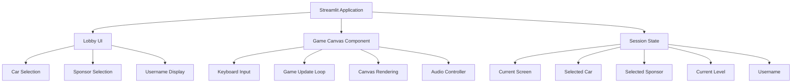
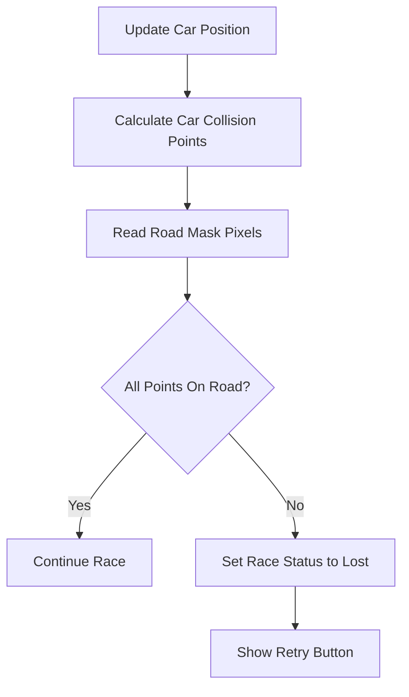
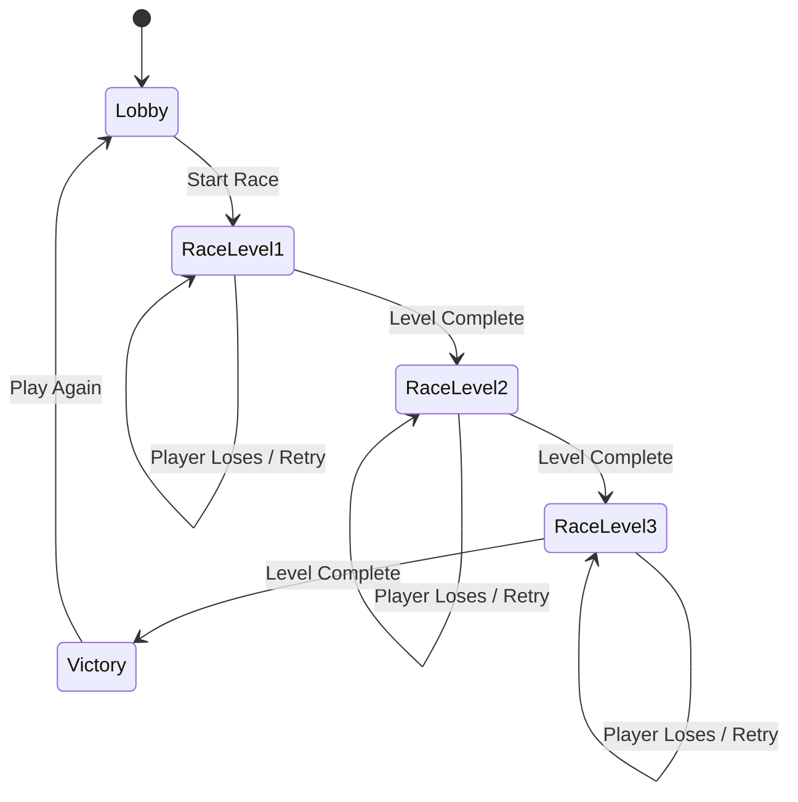

# Crazy Car — Software Program Design Document

## 1. Document Information

| Field | Value |
|---|---|
| Project Name | Crazy Car |
| Application Type | Browser-based top-down racing game |
| Primary Framework | Streamlit |
| Target Browsers | Microsoft Edge, Google Chrome |
| Document Type | Software Program Design Document |
| Version | 1.0 |
| Status | Proposed Design |

---

## 2. Purpose

Crazy Car is a simple top-down racing game built with Streamlit. The player selects a car and fictional sponsor, then drives through three increasingly difficult racing tracks.

The game is intended to be:

- Easy to understand
- Beginner-friendly to maintain
- Fully playable in a modern web browser
- Visually consistent across the lobby, game screen, logo, cars, and tracks
- Implemented with straightforward Python and JavaScript logic

The design avoids unnecessary frameworks, complex object hierarchies, and advanced design patterns.

---

## 3. Scope

The application will include:

- A polished racing-game lobby
- Random username generation
- Three selectable cars
- Five fictional sponsor options
- Three racing levels
- Keyboard-based driving controls
- Top-down car and track rendering
- Road-boundary collision detection
- Automatic level progression
- Lobby and racing music
- A consistent Crazy Car logo and visual theme
- Race status information in a heads-up display

The application will not include:

- Online multiplayer
- User accounts
- Saved game progress
- Real racing sponsors
- Obstacles or opponent cars
- Backend databases
- Cloud-based persistence
- Advanced vehicle damage simulation

---

## 4. Product Goals

The main goals are:

1. Let the player start a race with minimal setup.
2. Make the controls feel like a simple top-down car rather than a sliding character.
3. Increase difficulty clearly across three levels.
4. Keep the source code readable for a mid-level Python developer.
5. Ensure the game runs inside Microsoft Edge and Google Chrome.
6. Maintain a consistent racing identity across the logo, menus, HUD, and track visuals.

---

## 5. Functional Requirements

### 5.1 Lobby

The lobby must display:

- Crazy Car logo
- Generated username
- Car selection area
- Sponsor selection area
- Selected car summary
- Selected sponsor summary
- Start Race button
- Lobby music controls

The player must be able to choose one car and one sponsor before starting a race.

### 5.2 Random Username

When the Streamlit application starts, it must create a random username.

Examples:

- RacerFalcon492
- TurboNovaX
- DriftTiger318
- SpeedComet77

The username must:

- Be stored only in the current Streamlit session
- Change after a full browser refresh or new session
- Appear in the lobby
- Appear during car selection
- Appear during sponsor selection
- Appear in the race HUD

### 5.3 Car Selection

The lobby must provide three cars.

| Car | Design | Speed | Steering |
|---|---|---:|---:|
| Crimson Bolt | Red sports car with white racing stripe | High | Medium |
| Neon Phantom | Electric blue futuristic racer | Medium | High |
| Golden Viper | Gold and black performance car | Medium-High | Medium-High |

Each car must include:

- Name
- Color
- Simple graphic or preview
- Maximum speed
- Acceleration value
- Steering sensitivity

The differences should remain small so all cars are easy to control.

### 5.4 Sponsor Selection

The player must choose one fictional sponsor:

- ThunderOil Racing
- Apex Dynamics
- VelocityWear
- NitroByte Energy
- TitanTrack Motorsports

The sponsor must appear:

- In the lobby summary
- On the selected car
- In the race HUD

The sponsor can be represented on the car using a small text label, abbreviation, or sponsor-colored badge.

### 5.5 Race Controls

The game must use arrow keys.

| Key | Action |
|---|---|
| Up Arrow | Accelerate forward |
| Down Arrow | Reverse |
| Left Arrow | Rotate car left |
| Right Arrow | Rotate car right |

The car must move only in the direction it is facing.

The car must not slide sideways when the player presses left or right.

### 5.6 Race Rules

The player must:

- Stay within the road
- Follow the track
- Reach the finish area

The player loses when the center or collision points of the car move outside the valid road area.

There are no obstacles.

When the player completes a level:

1. The current race is marked complete.
2. A short level-complete message is displayed.
3. The next level loads automatically.
4. The player starts near the beginning of the next track.

After Level 3 is completed, the game displays a final victory screen.

### 5.7 Music

The application must include:

- Calm lobby music
- Intense racing music

Music behavior:

- Lobby music plays while the player is in the lobby.
- Racing music starts when the race begins.
- Lobby music resumes when the player returns to the lobby.
- Racing music continues between levels.
- A mute or volume control should be available.

Because Streamlit reruns Python code frequently, browser-side audio control should be handled through an embedded HTML and JavaScript component.

---

## 6. Difficulty Progression

Difficulty increases through track length, road width, and layout complexity.

| Level | Track | Road Width | Track Length | Layout Difficulty |
|---|---|---|---|---|
| 1 | Daytona International Speedway | Wide | Short | Simple oval |
| 2 | Silverstone Circuit | Medium | Longer | Multiple sweeping turns |
| 3 | Monaco Grand Prix Circuit | Very narrow | Longest | Tight street-style turns |

### 6.1 Level 1 — Daytona International Speedway

Characteristics:

- Wide road
- Shortest route
- Large oval layout
- Gentle curves
- Easy introduction to acceleration and steering

Purpose:

- Teach basic controls
- Let the player understand car direction
- Reduce early frustration

### 6.2 Level 2 — Silverstone Circuit

Characteristics:

- Medium road width
- Longer track
- Wider variety of curves
- More steering adjustments
- New layout

Purpose:

- Require better control
- Introduce longer periods of sustained driving
- Test turning accuracy

### 6.3 Level 3 — Monaco Grand Prix Circuit

Characteristics:

- Narrowest road
- Longest track
- Tight turns
- Street-circuit appearance
- New layout

Purpose:

- Require careful steering
- Penalize excessive speed
- Provide the final challenge

---

## 7. High-Level Architecture

The application uses a simple three-part architecture.



### 7.1 Streamlit Layer

Streamlit is responsible for:

- Page layout
- Lobby controls
- Selection menus
- Session state
- Start and restart actions
- Showing instructions and status messages

### 7.2 Browser Game Layer

An embedded HTML canvas and JavaScript component is responsible for:

- Reading arrow-key input
- Updating the car multiple times per second
- Drawing the track
- Drawing the car
- Detecting road boundaries
- Detecting finish-line completion
- Controlling music

### 7.3 Shared State

Streamlit session state stores:

- Username
- Selected car
- Selected sponsor
- Current level
- Current game screen
- Music preference
- Race result

---

## 8. Recommended Project Structure

```text
crazy-car/
│
├── app.py
├── game_config.py
├── game_component.py
├── requirements.txt
│
├── assets/
│   ├── logo.svg
│   ├── lobby_music.mp3
│   ├── racing_music.mp3
│   └── cars/
│       ├── crimson_bolt.svg
│       ├── neon_phantom.svg
│       └── golden_viper.svg
│
└── styles/
    └── game.css
```

### 8.1 File Responsibilities

#### `app.py`

Contains:

- Streamlit page configuration
- Session-state setup
- Lobby layout
- Car selection
- Sponsor selection
- Screen transitions
- Game component loading

#### `game_config.py`

Contains simple dictionaries for:

- Cars
- Sponsors
- Levels
- Track points
- Game constants

#### `game_component.py`

Contains:

- HTML template
- Canvas element
- JavaScript game loop
- Keyboard input
- Car movement
- Collision detection
- Drawing code
- Music switching

#### `styles/game.css`

Contains:

- Colors
- Buttons
- Cards
- Sponsor badges
- Lobby styling
- HUD styling
- Responsive layout rules

---

## 9. Streamlit Session State Design

The application should initialize values only when they are missing.

```python
if "username" not in st.session_state:
    st.session_state.username = generate_username()

if "screen" not in st.session_state:
    st.session_state.screen = "lobby"

if "selected_car" not in st.session_state:
    st.session_state.selected_car = "Crimson Bolt"

if "selected_sponsor" not in st.session_state:
    st.session_state.selected_sponsor = "ThunderOil Racing"

if "current_level" not in st.session_state:
    st.session_state.current_level = 1
```

### 9.1 Session State Fields

| Field | Type | Example |
|---|---|---|
| `username` | String | `RacerFalcon492` |
| `screen` | String | `lobby`, `race`, `victory` |
| `selected_car` | String | `Crimson Bolt` |
| `selected_sponsor` | String | `Apex Dynamics` |
| `current_level` | Integer | `1` |
| `music_enabled` | Boolean | `True` |
| `race_status` | String | `ready`, `racing`, `lost`, `complete` |

---

## 10. Data Design

### 10.1 Car Configuration

Cars should be stored in a simple dictionary.

```python
CARS = {
    "Crimson Bolt": {
        "primary_color": "#E53935",
        "secondary_color": "#FFFFFF",
        "max_speed": 4.8,
        "acceleration": 0.10,
        "turn_speed": 0.055,
        "preview": "assets/cars/crimson_bolt.svg",
    },
    "Neon Phantom": {
        "primary_color": "#00B8FF",
        "secondary_color": "#102A43",
        "max_speed": 4.5,
        "acceleration": 0.09,
        "turn_speed": 0.062,
        "preview": "assets/cars/neon_phantom.svg",
    },
    "Golden Viper": {
        "primary_color": "#F5B700",
        "secondary_color": "#111111",
        "max_speed": 4.7,
        "acceleration": 0.095,
        "turn_speed": 0.058,
        "preview": "assets/cars/golden_viper.svg",
    },
}
```

### 10.2 Sponsor Configuration

```python
SPONSORS = {
    "ThunderOil Racing": {
        "short_name": "TOR",
        "color": "#FF6B00",
    },
    "Apex Dynamics": {
        "short_name": "APEX",
        "color": "#7B61FF",
    },
    "VelocityWear": {
        "short_name": "VW",
        "color": "#00C853",
    },
    "NitroByte Energy": {
        "short_name": "NBE",
        "color": "#00ACC1",
    },
    "TitanTrack Motorsports": {
        "short_name": "TTM",
        "color": "#C62828",
    },
}
```

### 10.3 Level Configuration

```python
LEVELS = {
    1: {
        "name": "Daytona International Speedway",
        "road_width": 120,
        "track_type": "oval",
        "target_laps": 1,
    },
    2: {
        "name": "Silverstone Circuit",
        "road_width": 90,
        "track_type": "sweeping",
        "target_laps": 1,
    },
    3: {
        "name": "Monaco Grand Prix Circuit",
        "road_width": 65,
        "track_type": "street",
        "target_laps": 1,
    },
}
```

---

## 11. Track Generation Design

To keep the code simple, each track should be defined as a list of center-line points.

Example:

```python
DAYTONA_POINTS = [
    (180, 150),
    (500, 150),
    (650, 250),
    (650, 450),
    (500, 550),
    (180, 550),
    (50, 450),
    (50, 250),
]
```

The road is drawn by connecting the points with thick lines.

### 11.1 Road Rendering

For every pair of track points:

1. Draw a wide dark border line.
2. Draw a slightly narrower asphalt-colored line on top.
3. Draw a dashed center line.
4. Draw the finish line near the first point.

This creates a road without requiring complex track geometry.

### 11.2 Road Shrinking

The same rendering method is used for all levels.

Only the configured `road_width` changes:

- Level 1: 120 pixels
- Level 2: 90 pixels
- Level 3: 65 pixels

A smaller width creates less room for steering mistakes.

### 11.3 Map Layout Changes

Each level uses a different point list.

- Daytona uses a simple oval.
- Silverstone uses long sweeping curves.
- Monaco uses many short segments and tight turns.

This changes the driving experience while keeping the drawing code the same.

---

## 12. Car Movement and Physics

The car state contains:

```text
x position
y position
rotation angle
current speed
```

### 12.1 Rotation

Pressing the left or right arrow changes the rotation angle.

```javascript
if (keys.ArrowLeft) {
    car.angle -= car.turnSpeed;
}

if (keys.ArrowRight) {
    car.angle += car.turnSpeed;
}
```

For more realistic steering, rotation can be reduced when the car is nearly stopped.

```javascript
const steeringStrength = Math.min(Math.abs(car.speed) / 2, 1);
car.angle += car.turnSpeed * steeringStrength;
```

### 12.2 Acceleration

The Up Arrow increases forward speed.

```javascript
if (keys.ArrowUp) {
    car.speed += car.acceleration;
}
```

The Down Arrow creates reverse movement.

```javascript
if (keys.ArrowDown) {
    car.speed -= car.reverseAcceleration;
}
```

Speed is limited.

```javascript
car.speed = Math.max(
    -car.maxReverseSpeed,
    Math.min(car.speed, car.maxSpeed)
);
```

### 12.3 Directional Movement

The car moves based on its angle.

```javascript
car.x += Math.cos(car.angle) * car.speed;
car.y += Math.sin(car.angle) * car.speed;
```

This is the key rule that prevents sideways sliding.

The left and right keys only rotate the car. They do not directly change the x or y position.

### 12.4 Friction

When the player is not accelerating, speed slowly decreases.

```javascript
car.speed *= 0.97;
```

Friction prevents the car from moving forever after the player releases the controls.

---

## 13. Collision Detection

The simplest recommended approach is canvas pixel checking.

### 13.1 Collision Mask

The game creates a hidden canvas containing:

- White pixels for valid road
- Black pixels for off-road areas

The car checks the pixel color under several collision points.

Recommended collision points:

- Car center
- Front-left corner
- Front-right corner
- Rear-left corner
- Rear-right corner

If any required point is outside the road mask, the player loses.

### 13.2 Collision Flow



### 13.3 Why Use a Collision Mask

A collision mask is suitable because it:

- Matches the road drawing
- Works with curved lines
- Avoids advanced geometry
- Is simple to explain
- Is easy to adjust when road width changes

---

## 14. Finish Detection

The finish line is represented as a small rectangular area.

The game checks whether the car center enters that area.

To prevent the level from completing immediately at the start, the player must first pass one or more checkpoints.

Example checkpoint order:

```text
Start → Checkpoint 1 → Checkpoint 2 → Finish
```

The game stores the next required checkpoint number.

When all checkpoints are passed and the car reaches the finish area, the level is complete.

---

## 15. Game Flow



### 15.1 Lobby to Race

When the player selects Start Race:

1. Validate that a car is selected.
2. Validate that a sponsor is selected.
3. Set `current_level` to 1.
4. Set `screen` to `race`.
5. Switch from lobby music to racing music.
6. Load the Level 1 track.

### 15.2 Level Completion

When the game detects completion:

1. Freeze car controls.
2. Display a level-complete overlay.
3. Increase the current level.
4. Load the next track after a short delay.
5. Reset the car position and speed.

### 15.3 Player Loss

When the car leaves the road:

1. Stop the game loop.
2. Display an off-road message.
3. Offer Retry Level.
4. Offer Return to Lobby.

### 15.4 Final Victory

After Level 3:

1. Display the username.
2. Display the selected car.
3. Display the sponsor.
4. Show a championship message.
5. Offer Play Again.
6. Offer Return to Lobby.

---

## 16. User Interface Design

### 16.1 Visual Theme

Recommended visual theme:

- Dark charcoal background
- Asphalt gray panels
- Red, orange, and electric-blue highlights
- White primary text
- Subtle checkered-flag patterns
- Rounded cards
- Bold racing-style headings

### 16.2 Logo Design

The Crazy Car logo should include:

- The words `CRAZY CAR`
- A speedometer or tire symbol
- Motion lines
- Red-to-orange racing gradient
- Dark outline
- Small checkered-flag detail

An SVG logo is recommended because it:

- Scales cleanly
- Loads quickly
- Can be styled with the same game colors
- Does not require an external image service

### 16.3 Lobby Layout

Suggested layout:

```text
--------------------------------------------------
|                  CRAZY CAR                     |
|              Welcome, Username                 |
--------------------------------------------------
| Car Selection                                  |
| [Car 1]       [Car 2]       [Car 3]            |
--------------------------------------------------
| Sponsor Selection                              |
| [Sponsor Dropdown or Sponsor Cards]            |
--------------------------------------------------
| Selected Car | Selected Sponsor | Start Race   |
--------------------------------------------------
```

### 16.4 Race HUD

The HUD should display:

- Username
- Current level
- Track name
- Selected car
- Selected sponsor
- Current speed
- Music status

Example:

```text
RacerFalcon492 | Level 2: Silverstone Circuit
Car: Neon Phantom | Sponsor: Apex Dynamics | Speed: 132
```

---

## 17. CSS Design

Recommended CSS variables:

```css
:root {
    --background: #101419;
    --panel: #1b222b;
    --road: #3a414a;
    --text: #f7f9fb;
    --muted-text: #aab4c0;
    --primary: #ff3d2e;
    --secondary: #ff9800;
    --accent: #00b8ff;
    --success: #23c483;
    --danger: #ff4d4f;
}
```

The CSS should style:

- Streamlit page background
- Header and logo area
- Car cards
- Selected card borders
- Sponsor badges
- Start button
- Game canvas container
- HUD
- Level-complete and loss overlays

The design should remain responsive for common desktop browser sizes.

---

## 18. Browser Event Handling

Standard Streamlit widgets do not continuously capture arrow-key presses.

The recommended approach is:

1. Use Streamlit for menus and page state.
2. Embed an HTML canvas with JavaScript.
3. Capture `keydown` and `keyup` events in JavaScript.
4. Run the game loop with `requestAnimationFrame`.

Example:

```javascript
const keys = {};

window.addEventListener("keydown", function(event) {
    if (event.key.startsWith("Arrow")) {
        event.preventDefault();
    }
    keys[event.key] = true;
});

window.addEventListener("keyup", function(event) {
    keys[event.key] = false;
});
```

Preventing the default arrow-key action stops the browser page from scrolling while the player drives.

---

## 19. Game Loop Design

The game loop runs inside the browser.

```javascript
function gameLoop() {
    if (gameStatus === "racing") {
        readControls();
        updateCar();
        checkRoadCollision();
        checkCheckpoints();
        checkFinish();
        drawScene();
    }

    requestAnimationFrame(gameLoop);
}
```

This is better than using repeated Streamlit reruns because the browser can update the game smoothly.

Streamlit remains responsible for larger transitions such as entering the race, restarting, or returning to the lobby.

---

## 20. Music Switching Design

### 20.1 Audio Elements

The embedded HTML can contain two audio elements.

```html
<audio id="lobbyMusic" loop>
    <source src="data:audio/mp3;base64,..." type="audio/mpeg">
</audio>

<audio id="racingMusic" loop>
    <source src="data:audio/mp3;base64,..." type="audio/mpeg">
</audio>
```

### 20.2 Music State

The application uses a simple mode value:

```text
lobby
race
muted
```

### 20.3 Switching Logic

```javascript
function switchMusic(mode) {
    lobbyMusic.pause();
    racingMusic.pause();

    if (!musicEnabled) {
        return;
    }

    if (mode === "lobby") {
        lobbyMusic.play();
    }

    if (mode === "race") {
        racingMusic.play();
    }
}
```

Modern browsers may block automatic audio until the user interacts with the page. The Start Race button or an Enable Music button should be used as the first user interaction that begins playback.

---

## 21. Random Username Generation

The username is built from simple word lists.

```python
import random

PREFIXES = [
    "Racer",
    "Turbo",
    "Drift",
    "Speed",
    "Nitro",
]

NAMES = [
    "Falcon",
    "Nova",
    "Tiger",
    "Comet",
    "Viper",
]

def generate_username():
    prefix = random.choice(PREFIXES)
    name = random.choice(NAMES)
    number = random.randint(10, 999)
    return f"{prefix}{name}{number}"
```

The generated username is placed in `st.session_state`.

It remains the same during Streamlit reruns but changes when a new browser session is created.

---

## 22. Sponsor Display Logic

The selected sponsor is stored by name.

Example:

```python
selected_sponsor = SPONSORS[st.session_state.selected_sponsor]
```

The lobby displays:

- Full sponsor name
- Sponsor color
- Sponsor abbreviation

The car displays:

- A small sponsor-colored rectangle
- Sponsor abbreviation inside the rectangle

The race HUD displays:

- Full sponsor name

This avoids needing separate sponsor image files.

---

## 23. Error Handling

The application should handle the following situations.

| Situation | Expected Behavior |
|---|---|
| Missing asset file | Show a simple fallback graphic |
| Music cannot autoplay | Show Enable Music button |
| No car selected | Keep Start Race disabled |
| No sponsor selected | Keep Start Race disabled |
| Game component fails | Show an error and Return to Lobby button |
| Player leaves road | Stop race and show Retry |
| Browser window loses focus | Clear pressed-key state |
| Unsupported small screen | Show desktop-play recommendation |

Example key reset:

```javascript
window.addEventListener("blur", function() {
    Object.keys(keys).forEach(function(key) {
        keys[key] = false;
    });
});
```

---

## 24. Non-Functional Requirements

### 24.1 Performance

- The canvas should target approximately 60 frames per second.
- The game should avoid large image assets.
- SVG or canvas-drawn car graphics are preferred.
- Track data should remain small.
- Streamlit reruns should not occur on every animation frame.

### 24.2 Maintainability

- Use simple functions.
- Use descriptive variable names.
- Keep configuration separate from game logic.
- Avoid unnecessary classes.
- Add comments to movement, collision, and state-transition code.
- Keep track definitions readable.

### 24.3 Usability

- Controls must be shown before the race starts.
- Selected items must be visually highlighted.
- Loss and completion messages must be clear.
- The lobby must work without instructions from an external document.

### 24.4 Compatibility

The application should support current desktop versions of:

- Microsoft Edge
- Google Chrome

Keyboard controls are the primary interaction method.

### 24.5 Security

The game does not require authentication or personal information.

The application should:

- Use local static assets
- Avoid untrusted HTML input
- Avoid executing user-provided JavaScript
- Avoid storing session information outside Streamlit
- Use fictional sponsor names only

---

## 25. Testing Strategy

### 25.1 Unit Tests

Test Python helper functions:

- Username generation
- Car configuration lookup
- Sponsor configuration lookup
- Level progression
- Session-state initialization

### 25.2 Browser Tests

Verify:

- Arrow keys do not scroll the page
- Car rotates left and right
- Up Arrow moves forward
- Down Arrow reverses
- Car follows its facing direction
- Off-road driving causes a loss
- Finish-line completion loads the next level
- Music switches correctly
- Username appears in all required screens

### 25.3 Level Tests

#### Level 1

- Road is wide
- Track is short
- Oval layout appears correctly
- New player can finish comfortably

#### Level 2

- Road is narrower
- Track is longer
- Layout differs from Level 1
- Curves require more steering

#### Level 3

- Road is narrowest
- Track is longest
- Layout differs from Levels 1 and 2
- Tight turns are challenging but playable

### 25.4 Cross-Browser Tests

Test in:

- Microsoft Edge
- Google Chrome

Verify:

- Canvas drawing
- Keyboard events
- Audio playback
- Layout sizing
- Streamlit controls

---

## 26. Deployment

### 26.1 Local Run

Install dependencies:

```bash
pip install -r requirements.txt
```

Run the application:

```bash
streamlit run app.py
```

Open the displayed local URL in Microsoft Edge or Google Chrome.

### 26.2 Example Requirements

```text
streamlit>=1.40
```

No game engine is required.

### 26.3 Streamlit Community Cloud

The project can be deployed by:

1. Uploading the project to a Git repository.
2. Connecting the repository to Streamlit Community Cloud.
3. Selecting `app.py` as the entry file.
4. Confirming that all assets are included in the repository.

---

## 27. Implementation Sequence

Recommended development order:

1. Create the Streamlit page and session-state values.
2. Build the random username function.
3. Create the Crazy Car logo and CSS theme.
4. Build the car selection cards.
5. Build sponsor selection.
6. Create the Start Race transition.
7. Add the HTML canvas.
8. Draw Level 1.
9. Add car rotation and acceleration.
10. Add road-mask collision detection.
11. Add finish checkpoints.
12. Add Levels 2 and 3.
13. Add automatic level progression.
14. Add lobby and racing music.
15. Add victory and retry screens.
16. Test in Edge and Chrome.

---

## 28. Beginner-Friendly Explanation

### Difficulty Progression

Each level becomes harder in three ways:

- The road becomes narrower.
- The route becomes longer.
- The track shape changes.

The code uses different configuration values for each level instead of creating separate game systems.

### Track Generation

Each track is a list of points. The game connects those points with thick canvas lines. This produces a road that can curve and change shape.

### Road Shrinking

The same track-drawing function receives a different road width for each level. A lower road-width value creates a narrower road.

### Map Layout Changes

Each level has its own list of track points. The drawing function stays the same, but the resulting map looks different.

### Car Rotation and Acceleration

Left and right change the car angle. Up and down change the car speed. The x and y positions are calculated from the angle, so the car always moves in the direction it faces.

### Sponsor Selection

The selected sponsor is stored in Streamlit session state. The sponsor name and color are then passed to the lobby, car graphic, and race HUD.

### Random Username

A username is created by randomly joining racing-related words and a number. It is stored only for the current browser session.

### Music Switching

The application has separate lobby and race audio tracks. JavaScript pauses one track before playing the other. Music starts only after the player interacts with the page.

### Game Flow Transitions

The main screen value controls what the player sees:

- `lobby` shows selections.
- `race` shows the canvas.
- `victory` shows the final result.

Level completion increases the level number and reloads the canvas with the next track.

---

## 29. Acceptance Criteria

The project is complete when:

- The game runs through Streamlit.
- It works in Microsoft Edge and Google Chrome.
- A random username appears after startup.
- Three cars can be selected.
- Five fictional sponsors can be selected.
- The sponsor appears in the lobby, car, and race HUD.
- Arrow keys control acceleration, reverse, and rotation.
- The car moves only in its facing direction.
- Leaving the road causes the player to lose.
- Three different tracks are available.
- Each level is longer and narrower than the previous level.
- The next level loads automatically.
- Lobby and race music switch automatically.
- The visual design, logo, and CSS are consistent.
- The source code remains simple, readable, and commented.

---

## 30. Future Enhancements

Possible later improvements include:

- Lap timing
- Best-time tracking during the current session
- Mobile touch controls
- Controller support
- Weather effects
- Tire marks
- Engine sound effects
- Additional cars
- Additional fictional tracks
- Difficulty settings
- Simple AI opponent cars

These enhancements are outside the first version and should not complicate the initial implementation.
