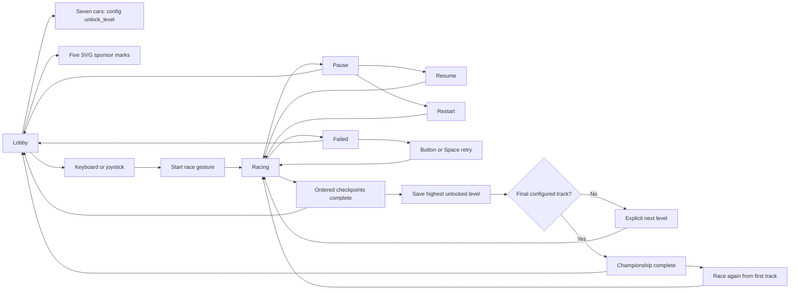

# CrazyCar graph

Current implementation; source is `app.py`, `game_config.py` and `game/`.

```mermaid
flowchart LR
    Lobby --> Car[Seven cars: config unlock_level]
    Lobby --> Sponsor[Five SVG sponsor marks]
    Lobby --> Mode[Keyboard or joystick]
    Mode --> Ready[Start race gesture]
    Ready --> Racing
    Racing --> Pause
    Pause --> Resume --> Racing
    Pause --> Restart --> Racing
    Racing --> Failed
    Failed --> Retry[Button or Space retry] --> Racing
    Racing --> Complete[Ordered checkpoints complete]
    Complete --> Progress[Save highest unlocked level]
    Progress --> Next{Final configured track?}
    Next -->|No| NextLevel[Explicit next level] --> Racing
    Next -->|Yes| Championship[Championship complete]
    Championship --> Again[Race again from first track] --> Racing
    Pause --> Lobby
    Failed --> Lobby
    Complete --> Lobby
    Championship --> Lobby
```
