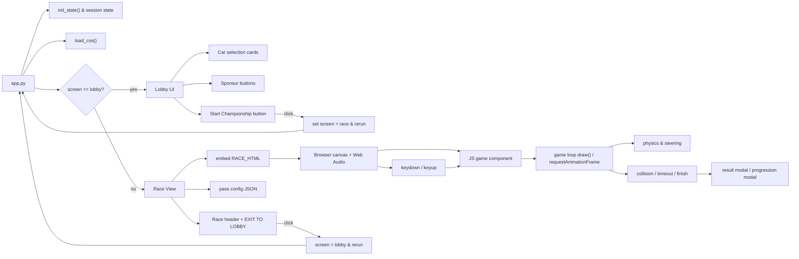

```mermaid
---
references:
  - "File: /CrazyCar/app.py"
---
graph LR
    App[app.py] --> State["init_state() & session state"]
    App --> CSS["load_css()"]
    App --> Decision{screen == lobby?}
    Decision -->|yes| Lobby[Lobby UI]
    Decision -->|no| Race[Race View]

    Lobby --> Cars["Car selection cards"]
    Lobby --> Sponsors["Sponsor buttons"]
    Lobby --> Start["Start Championship button"]
    Start -->|click| SetRace["set screen = race & rerun"]
    SetRace --> App

    Race --> Header["Race header + EXIT TO LOBBY"]
    Race --> Embed["embed RACE_HTML"]
    Race --> Config["pass config JSON"]
    Embed --> Browser["Browser canvas + Web Audio"]
    Browser --> JS["JS game component"]
    JS --> Loop["game loop draw() / requestAnimationFrame"]
    Loop --> Physics["physics & steering"]
    Loop --> Checks["collision / timeout / finish"]
    Checks --> Modals["result modal / progression modal"]
    Browser --> Input["keydown / keyup"]
    Input --> JS

    Header -->|click| Exit["screen = lobby & rerun"]
    Exit --> App

```
