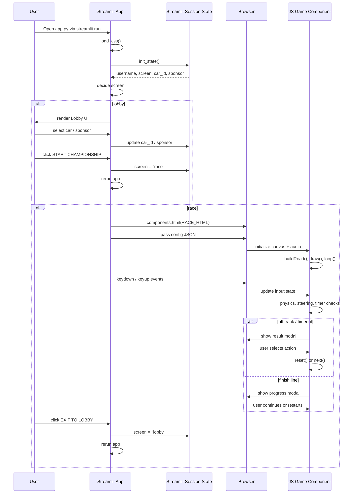

```mermaid
---
references:
  - "File: /CrazyCar/app.py"
---
sequenceDiagram
    participant U as User
    participant A as Streamlit App
    participant S as Streamlit Session State
    participant B as Browser
    participant J as JS Game Component

    U->>A: Open app.py via streamlit run
    A->>A: load_css()
    A->>S: init_state()
    S-->>A: username, screen, car_id, sponsor
    A->>A: decide screen
    alt lobby
        A->>U: render Lobby UI
        U->>A: select car / sponsor
        A->>S: update car_id / sponsor
        U->>A: click START CHAMPIONSHIP
        A->>S: screen = "race"
        A->>A: rerun app
    end
    alt race
        A->>B: components.html(RACE_HTML)
        A->>B: pass config JSON
        B->>J: initialize canvas + audio
        J->>J: buildRoad(), draw(), loop()
        U->>B: keydown / keyup events
        B->>J: update input state
        J->>J: physics, steering, timer checks
        alt off track / timeout
            J->>B: show result modal
            B->>J: user selects action
            J->>J: reset() or next()
        else finish line
            J->>B: show progress modal
            B->>J: user continues or restarts
        end
        U->>A: click EXIT TO LOBBY
        A->>S: screen = "lobby"
        A->>A: rerun app
    end

```
