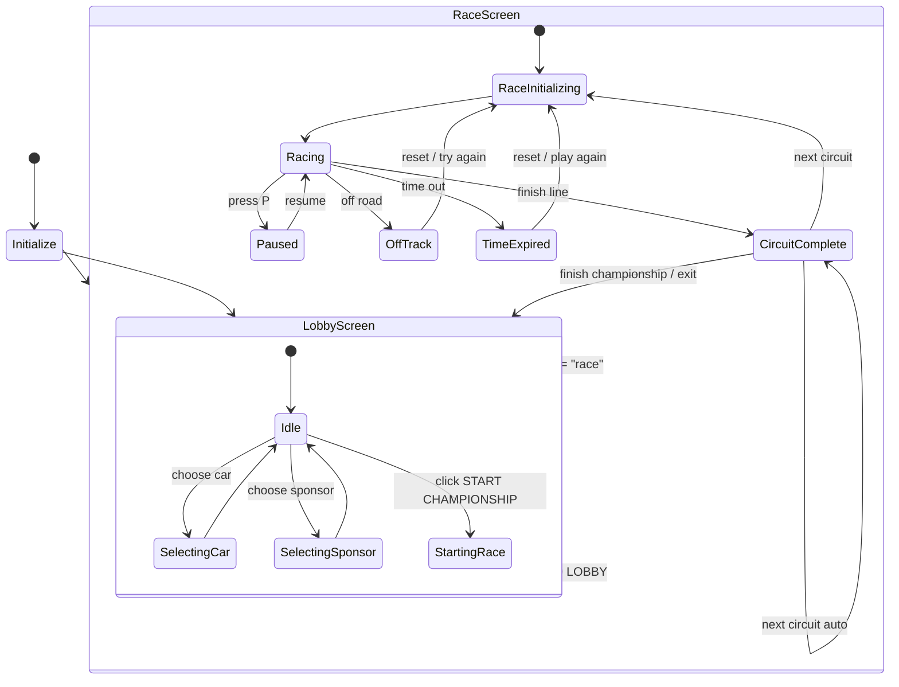

```mermaid
---
references:
  - "File: /CrazyCar/app.py"
---
stateDiagram-v2
    [*] --> Initialize
    Initialize --> LobbyScreen
    Initialize --> RaceScreen

    state LobbyScreen {
        [*] --> Idle
        Idle --> SelectingCar : choose car
        Idle --> SelectingSponsor : choose sponsor
        SelectingCar --> Idle
        SelectingSponsor --> Idle
        Idle --> StartingRace : click START CHAMPIONSHIP
    }

    state RaceScreen {
        [*] --> RaceInitializing
        RaceInitializing --> Racing
        Racing --> Paused : press P
        Racing --> OffTrack : off road
        Racing --> TimeExpired : time out
        Racing --> CircuitComplete : finish line
        Paused --> Racing : resume
        OffTrack --> RaceInitializing : reset / try again
        TimeExpired --> RaceInitializing : reset / play again
        CircuitComplete --> RaceInitializing : next circuit
        CircuitComplete --> LobbyScreen : finish championship / exit
    }

    RaceScreen --> LobbyScreen : EXIT TO LOBBY
    LobbyScreen --> RaceScreen : screen = "race"
    CircuitComplete --> CircuitComplete : next circuit auto

```

